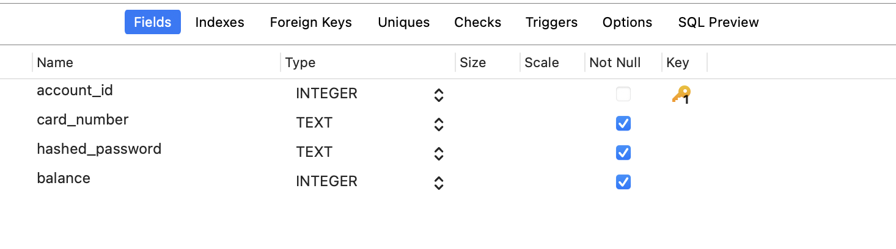

# ATM 模拟程序

## 项目概述

这是一个基于 Qt 与 SQLite 的 ATM 柜员机模拟程序，提供了基本的 ATM 功能，包括账户登录、查询余额、取款、存款、转账、修改密码、开卡与销户, 用于模拟 ATM 的核心功能。本项目为四川大学软件学院2024夏实训个人项目。

## 功能

1. **账户登录**：
   - 用户通过输入卡号和密码登录系统。
   - 初始卡号和密码为 `123456`。
   - 登录失败时会提示用户密码或账号不存在。

  

2. **主界面**：
   - 在最初登陆时余额将被隐藏，保护用户隐私。
   - 显示账户的当前余额。初始余额为 `10000` 元。
   - 点击各功能按钮前往各个功能模块。

3. **存款**：
   - 用户可以存款，存款金额不能为负数。
   - 存款完成后会实时更新账户余额。

4. **取款**：
   - 用户可以取款，每次取款金额必须是 `100` 的倍数。
   - 总取款金额不超过 `5000` 元。
   - 不允许透支。
   - 取款完成后会实时更新账户余额。

5. **修改密码**：
   - 用户可以修改密码，新密码必须满足以下条件：
     - 长度为 6 位。
     - 不允许出现 6 位完全相同的情况。
     - 新密码必须与确认密码匹配。
     - 旧密码必须正确。

6. **转账**:
   - 用户可以输入目标卡号和金额转账。
   - 转账后会实时更新用户余额。

7. **开卡/销户**:
   - 用户可以输入卡号与密码进行开卡/销户操作。
   - 开卡时卡号不允许重复。
   - 销户时指定卡号必须存在。
   - 密码必须与确认密码匹配。

## 数据库结构

数据库使用 SQLite 搭建，具体结构为：

Accounts 表:

| 字段            | 数据类型       | 约束             |
|-----------------|----------------|------------------|
| account_id      | INTEGER        | 主键，自动递增   |
| card_number     | TEXT           | 唯一，不为空     |
| hashed_password | TEXT           | 不为空           |
| balance         | INTEGER        | 不为空           |

## 编译和运行

1. **编译**：
   - 确保已安装 Qt6 开发环境。
   - 使用 Qt Creator 打开项目。
   - 选择合适的构建配置（Debug 或 Release）。
   - 进行编译。

2. **运行**：
   - 在 Qt Creator 中运行项目。
   - 启动应用程序并测试各项功能。

## 注意事项

- 程序的初始卡号和密码为 `123456`。
- 账户余额在内部作为以分为单位的整型进行处理。
- 密码修改功能要求密码长度正好为 6 位，且不允许出现 6 位完全相同的情况。

## 许可证

本项目使用 [MIT 许可证](LICENSE) 进行分发。

## 联系

如有任何问题或反馈，请通过 [me@sumi.link](mailto:me@sumi.link) 联系我。